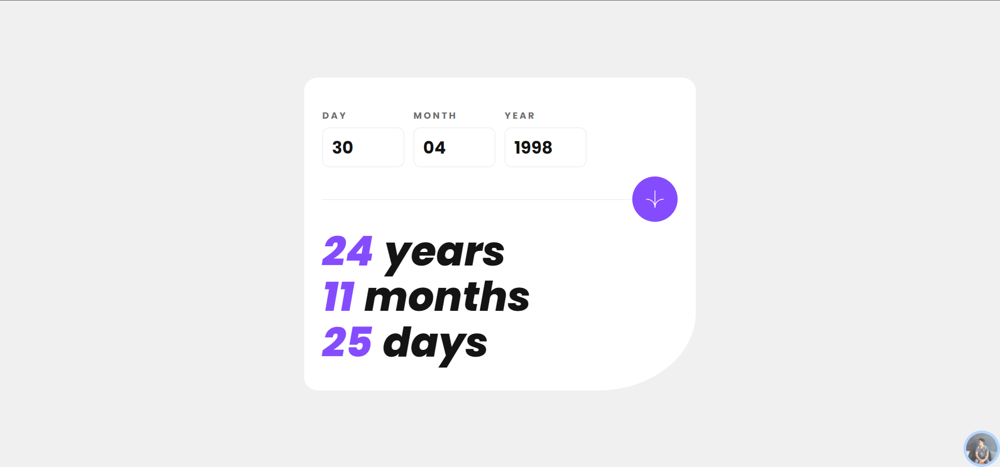
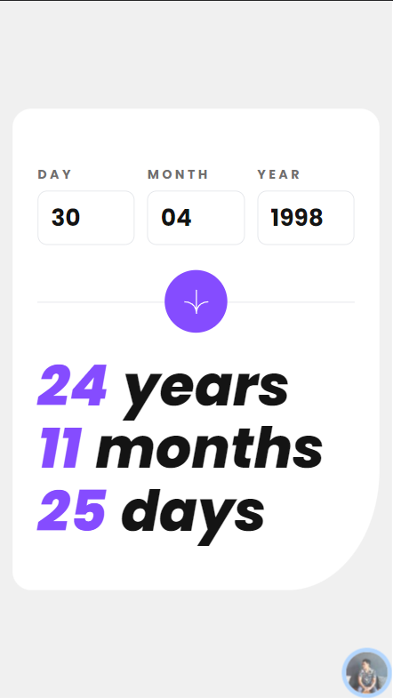

<div id="top"></div>

<div align="center">
  

  <h2 align="center">🎉 Age calculator app Solution 🎉 <br/><small>build with  Sveltekit &  Tailwindcss </small></h2>
  <p align="center">
    <a href="https://www.frontendmentor.io/challenges/ecommerce-product-page-UPsZ9MJp6"><strong>Frontend Mentor Challenge</strong></a>
    <br />
    <br />
     <a href="https://challenges-sveltekit-age-calculator-app.vercel.app/">View Demo</a>
    <strong>·</strong>
    <a href="https://github.com/kodaicoder/CHALLENGES_sveltekit_age-calculator-app/issues" target="_blank">Report Bug</a>
      <strong>·</strong>
    <a href="https://github.com/kodaicoder/CHALLENGES_sveltekit_age-calculator-app/issues" target="_blank">Request Feature</a>
  </p>
</div>

<!-- Bagdes -->
<div align="center">
  <!-- Profile -->
  <a href="https://www.frontendmentor.io/profile/NutchaponMake">
    
  </a>
  <!-- Status -->
    <a href="#">
    
  </a>
</div>

#

<div align="center">



</div>

## Welcome! 👋

Thanks for checking out this front-end coding challenge.

This is a solution to the [Age calculator app challenge on Frontend Mentor](https://www.frontendmentor.io/solutions/-age-calculator-app-solution-build-with-svelte-and-tailwindcss-eXYTm01jzB). Frontend Mentor challenges help you improve your coding skills by building realistic projects.

<h2 align="left">Links</h2>

- Live Site URL : [https://challenges-sveltekit-age-calculator-app.vercel.app/](https://challenges-sveltekit-age-calculator-app.vercel.app/)

<br>

## Table of contents

- [Overview](#overview)
  - [The challenge](#the-challenge)
  - [Screenshot](#screenshot)
- [My process](#my-process)
  - [Built with](#built-with)
- [Author](#author)
- [Acknowledgments](#acknowledgments)

## Overview

### The challenge

Users should be able to:

- View an age in years, months, and days after submitting a valid date through the form
- Receive validation errors if:
  - Any field is empty when the form is submitted
  - The day number is not between 1-31
  - The month number is not between 1-12
  - The year is in the future
  - The date is invalid e.g. 31/04/1991 (there are 30 days in April)
- View the optimal layout for the interface depending on their device's screen size
- See hover and focus states for all interactive elements on the page
- **Bonus**: See the age numbers animate to their final number when the form is submitted

### Screenshot




## My process

### Built with

<!-- Bagdes -->


- [Sveltekit](https://kit.svelte.dev/)
- [Tailwind CSS](https://tailwindcss.com/)
- [Yup](https://github.com/jquense/yup)
- [iMask](https://imask.js.org/)
- CSS Grid
- Semantic HTML5 markup

### Useful resources

- [Svelte](https://svelte.dev/)
- [Sveltekit](https://kit.svelte.dev/)
- [Tailwind CSS](https://tailwindcss.com/)
- [Yup](https://github.com/jquense/yup)
- [iMask](https://imask.js.org/)

## Author

-  Github - [Nutchapon](https://github.com/kodaicoder)
-  Twitter - [@SolanianNut](https://twitter.com/SolanianNut)
-  Frontend Mentor - [@NutchaponMake](https://www.frontendmentor.io/profile/NutchaponMake)

## Acknowledgments

### Run the project

To run the client, you need to run the following command:

```bash
npm install
npm run dev
//or//
npx vite
```
